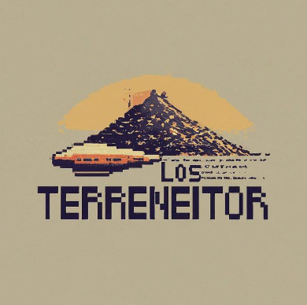

| Los Terreneitor |
| --------------- |

# Grupo UTN-FRSR - COHORTE 2024

### Integrantes:

- Agustín Salinas
- Juan Pablo Batallón Costa
- Franco Morales
- Maximiliano Tomio
- Elias Jacob
- Gabriel Calcagni

`Este grupo pertenece a la UTN Facultad Regional San Rafael (Mendoza) - Cohorte 2024`

## ¿Qué incluye este repositorio?

Este repositorio incluye las lecciones de laboratorio de programación de la facultad en la cual estamos viendo los siguientes lenguajes de programación:

| Lenguaje                                                                                             | Descripción          |
| ---------------------------------------------------------------------------------------------------- | -------------------- |
|                 | Estructura           |
|                      | Diseño               |
|  | Programación         |
|                    | Programación         |
|                    | Programación         |
|                       | Control de versiones |
